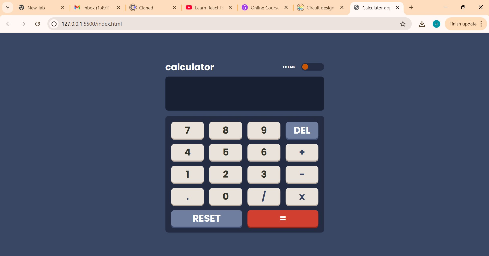
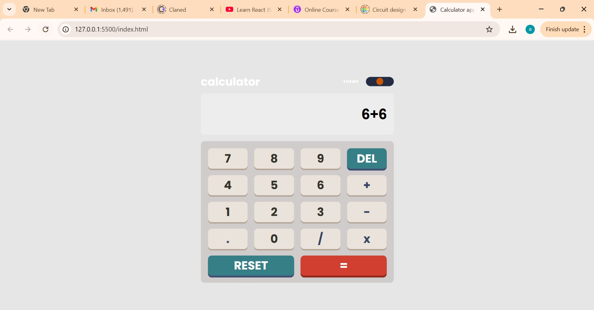
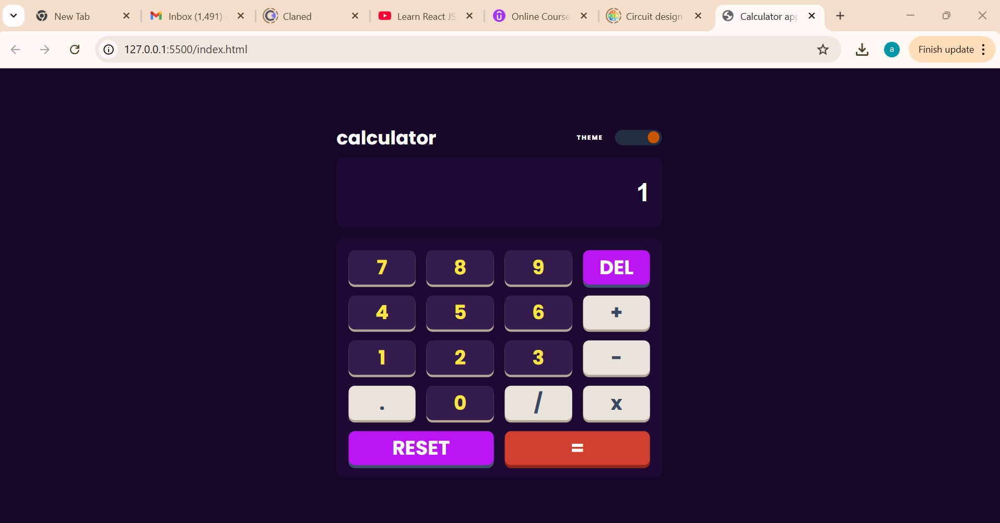

The project title is - "Simple/Basic Arithmetic CalculatorApp" 
# Calculator App



## 📌 Overview

This simple, theme-switching calculator is built using **HTML, CSS, and JavaScript**. The app supports three themes and allows users to perform basic arithmetic operations.

## 🎯 Features

✅ Perform basic arithmetic operations (Addition, Subtraction, Multiplication, Division)  
✅ Toggle between **three different themes** (Dark, Light, and Purple)  
✅ Interactive and responsive design  
✅ Mobile-friendly  

## 🚀 Demo

👉 **Live Demo:** [Your Live Link Here](https://your-link.com) *(no live demo)*

## 🛠️ Technologies Used

- **HTML5** for structure  
- **CSS3** for styling  
- **JavaScript (ES6)** for functionality  

## 📸 Screenshots

| Dark Theme | Light Theme | Purple Theme |
|------------|------------|--------------|
|  |  |  |

## 📥 Installation & Usage

### 1️⃣ Clone the Repository  
```sh
git clone https://github.com/Ataklti-tech/CalculatorApp
